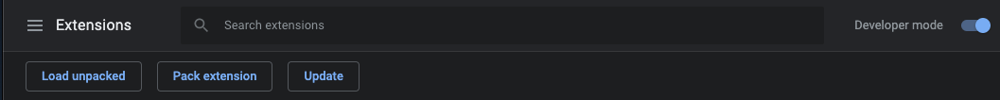
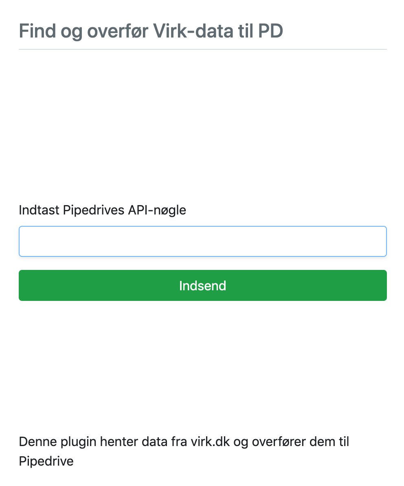
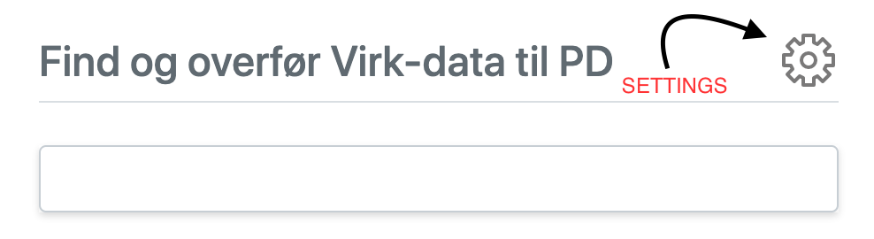

**CRM Plugin for Pipedrive**

Table of contents:

[[Download the plugin]](#download-the-plugin)

[[Installation guide]](#installation-guide)

[[Setup the plugin]](#setup-the-plugin)

[[!NB]](#nb)

[[Setup the new version]](#setup-the-new-version)

[[Usage]](#usage)

## **Download the plugin**

In order to download the extension click
[[here]](https://drive.google.com/open?id=131s77VPQP10oDj1UkUywNerxhMkTOEIA).

## **Installation guide**

1.  Extract plugin to anywhere on your PC.

2.  Write \'chrome://extensions\' in your Chrome Tab.

3.  Switch Developer mode on.

4.  Choose 'Load unpacked' and choose in the prompted window the exported folder.

Extension now should be usable.

## **Setup the plugin**

Provide your Pipedrive Company\'s API in here to proceed.

## **!NB**

Your Pipedrive Company **must** have following Custom Fields:

-   \*CVR

-   Name

-   Address

-   Tlf. (Reception)

-   Etableringsdato

-   Antal medarb.

-   Branchekode

-   Branchetekst

-   Selsksabsform

-   Status

-   Reklamebeskyttet

-   Kommune

Custom Fields **must** have exactly the same names if you want them to
be filled in Pipedrive!

You can change the API key in there at any time.

## **Setup the new version**

If you already got an older version of the extension you should either
replace the previous build folder with the new one or delete the
existing extension from chrome and follow the installation guide. After
changing the version of the extension you should remove the API token
and reenter it.

## **Usage**

-   **Search:**

Based on whether you type in text or numbers fetches companies either by
CVR number,

or by company name.

-   **Add:**

> Adds company to Pipedrive.\
> _You will not see this button if you already have company you are
> trying to add in Pipedrive._

-   **Update:**

> Updates information about the company in Pipedrive (overwrites custom
> fields )
>
> _You will not see this button unless you have found company in
> Pipedrive._

-   **Delete:**

> Totally erases company from Pipedrive. After pressing this button
> confirmation screen will appear.
>
> _You will not see this button unless you have found company in
> Pipedrive._
